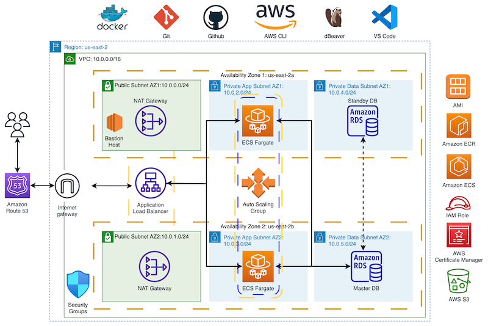

# terraform-ecs

This is a **Terraform Infrastructure as Code (IaC)** project that automates the deployment of a **3-tier dynamic web application** on AWS using **Elastic Container Service (ECS)** with an **RDS database backend**.

It showcases the use of Terraform modules and variables to provide reusable, data driven components for the Infrastructure as Code (IaC) deployment. The specifics of the deployment care configurable through an (unpublished) `terraforms.tfvars` file which sets values passed to the Terraform modules through the main code file.

## Architecture Overview

The project deploys a containerized PHP/Laravel application with the following AWS infrastructure:

**Tier 1 - Presentation Layer:**
- Application Load Balancer (ALB) in public subnets
- SSL/TLS certificate via AWS Certificate Manager (ACM)
- Route 53 DNS configuration

**Tier 2 - Application Layer:**
- ECS Cluster with containerized PHP/Laravel application
- Docker container (Amazon Linux 2 base with Apache, PHP 7.4, MySQL client)
- Auto Scaling Group for dynamic capacity management
- Private app subnets in multiple availability zones

**Tier 3 - Data Layer:**
- RDS MySQL database instance
- Private data subnets for isolation
- Multi-AZ deployment option for high availability

## Key Features

1. **Modular Design** - Uses reusable Terraform modules sourced from a private GitHub repository
2. **Multi-AZ Deployment** - Resources distributed across 2 availability zones for high availability
3. **Network Isolation** - VPC with 2 public and 4 private subnets (2 for apps, 2 for data)
4. **Security** - Comprehensive security groups and NAT gateways for private subnet internet access
5. **Configuration Management** - Environment variables stored in S3 bucket
6. **Scalability** - ECS with auto-scaling capabilities
7. **SSL/TLS** - Secure HTTPS connections via ACM certificates

## Infrastructure Components

- **VPC** with custom CIDR blocks
- **NAT Gateways** for private subnet outbound connectivity
- **Security Groups** for network-level access control
- **RDS MySQL** database instance
- **Application Load Balancer** with HTTPS listener
- **S3 Bucket** for environment configuration files
- **IAM Roles** for ECS task execution
- **ECS Cluster, Task Definition, and Service**
- **Auto Scaling Group** for ECS service
- **Route 53** DNS record

## Configuration

The deployment is configurable through a `terraform.tfvars` file which sets values passed to the Terraform modules. The modules are sourced from a separate, private, GitHub repository or can be sourced from local storage, allowing separate maintenance and versioning from individual projects.

## Pre-requisites

* AWS Account
* AWS CLI installed & configured locally
* GitHub account
* GitHub repo with Terraform modules (Optionally modules can sourced locally)
* Git installed & configured locally
* Terraform installed locally
* ECR Repo
* SSH client installed locally
* EC2 Key Pair
* dBeaver or MySQL Workbench installed locally

## Steps

1. Create VPC with 2 public and 2 private subnets
2. Create NAT Gateway
3. Create Security Groups
4. Create RDS instance and empty database and users
    1. Manually create Bastion host for SSH tunnel to RDS endpoint
    2. Manually Use SQL client to connect to database to create tables and import seed data. TOTO: Created database from snapshot.
5. Request Amazon TLS Certificate
6. Create Application Load Balancer for public subnets
7. Create S3 Bucket for environment file
8. Create IAM Assumed Role for ECS Task execution
9. Create ECS Cluster, Task Definition, and Service
10. Create Auto Scaling Group
11. Add DNS record to Route 53
